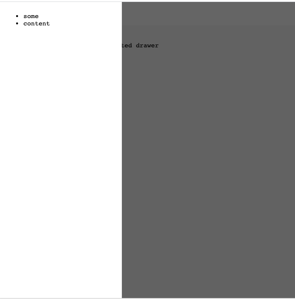

# snabbdom-drawer

a snabbdom based nav drawer




## usage

```javascript
import html   from 'https://cdn.jsdelivr.net/npm/snabby@1/snabby.js'
import drawer from './drawer.js'


const model = {
    drawer: drawer.init({ open: false }) // initial state of the drawer
}


// later, render like this:
drawer.view(model, html`<ul> <li>some</li> <li>content</li> </ul>`, update)
```
